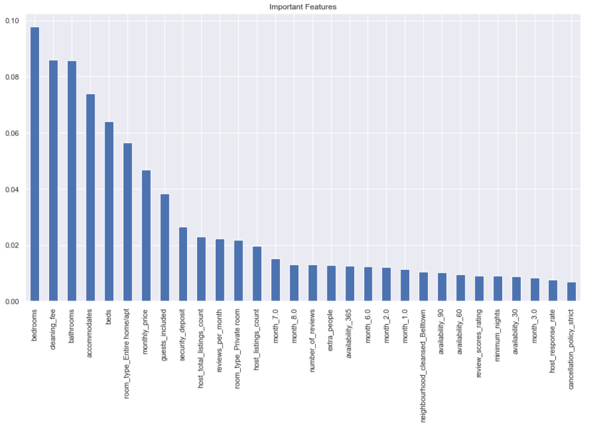
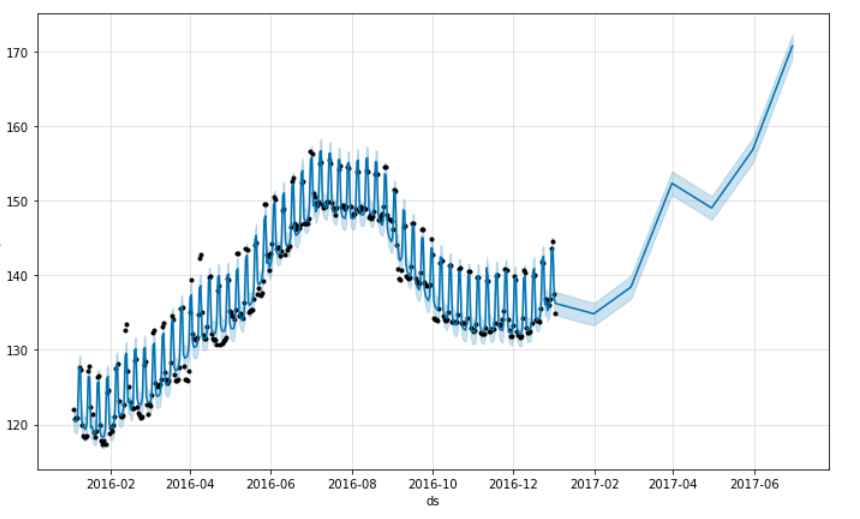
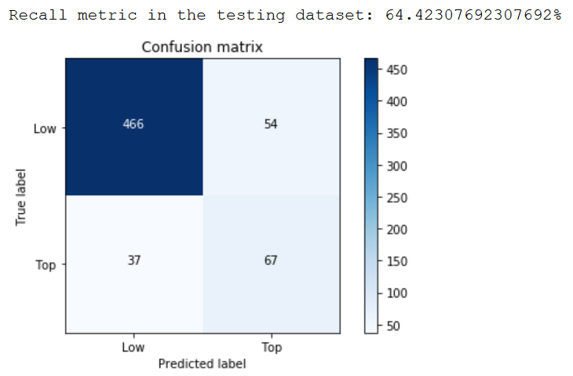
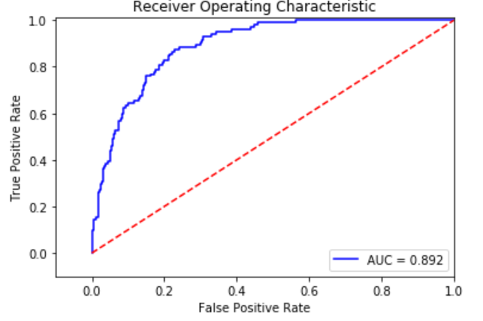

# Blog Post Airbnb Seattle
### Writing a Data Science blog post for Udacity DSND project 

### Overview
This project is part of Udacity's Data Science Nanodegree course. This repository includes the python codes to answer three questions about Airbnb in Seattle following the CRISP-DM process. The link to the blog post is [here](https://medium.com/@rahil.bagheri/using-data-to-help-seattle-airbnb-hosts-and-guests-make-smarter-decisions-39749cc43ae). 

### Motivation 
For this project, I was intersected in answering the following questions:
1) Which AirBnB listing is more profitable?
2) How the price rates change based on each listings' feature?
3) Forcast the price rates for future months, for example Jan or Feb 2017?

To answer each question I followed the CRISP-DM process including:

1) Business Understanding
2) Data Understanding
3) Prepare Data
4) Data Modeling
5) Evaluate the Results

### Business understanding 
Airbnb provides an excellent solution to short term accommodations. But it is time to use data and guide the new hosts to estimate more reasonable prices while maximizing their revenue. Also, help guests to know which accommodation factors they should pay more attention to save some money.I tried to focus on answering questions that might help both sides since every single of us can be both a host or guest. After exploring more abut Airbnb business I noticed there are 3 key factors that should be considered to answer those 3 questions;  price, revenue, and demand.

### Data understanding
Data available:
The Seattle AirBnB data can be found [here](https://www.kaggle.com/airbnb/seattle). There are 3 differnt csv data files:
1) Listings, including full descriptions and average review score  
2) Reviews, including unique id for each reviewer and detailed comments  
3) Calendar, including listing id and the price and availability for that day

Data formatting:
Fields that weren’t aligned with business objective like review comments were dropped. For the important features like price which was the response variable in most cases the records with missing values removed from analysis. And encode categorical variables with more than two levels and keep the missing as a new level to data, one hot encoding technique. For example, number of beds, bathrooms and bedrooms. For the numerical variables, I replace the missing values with the mean. 

Data engineering:
I defined a metric that measures revenue since there was not such a data point in the original dataset. I assumed the host’s income is estimated by the price per night times minimum times the place was booked. I grouped all the listed properties to two groups, the ones that performed better and caused revenue more than $10000 per year, top performers, and the ones that showed the opposite, low performers. 
To check if the data met the time series forecasting requirement, I log-transformed the price series to make it stationary.

### Modeling 
Based on each objective different Machine Learning and time series techniques are applied. For example, to predict price range I used Random Forest regressor since it was a regression problem and to forecast future price, I used time series forecasting model developed by Facebook, Prophet. And to classify listings, I benchmarked different classifiers Gradient Boosted, Logistic Regression, Support Vector Machine, and K nearest neighbor. And enhanced the GBM since got more accuracy.
I also applied resampling techniques, like SMOTE, to be sure the classifier can capture all unusual listings.
 
### Evaluation and key findings
Essential elements in Random Forest regressor were number of bedrooms, number of bathrooms, number of beds, number of included guests, number of reviews, season, neighborhood, cancellation fee, and policy strict. In general, these features can be categorized into three broad categories; one is the properties features, previous reviews, and seasonal and weekly demand.

The blue line represents the predicted values while the black dots represent the actual daily values . From the plot, it seems that the model can catch the seasonality and fit historical data very well.

Out of 520 low performer listings about 466 predicted accurately by this classifier. The area under the ROC curve shows the model accuracy in classifying these two groups for a new dataset is 89%. The followings are confusion matrix and ROC curve which shows how the GBM model performs on the totally new dataset. 

### File Description
These 3 questions are analyzed and answered through 3 different notebooks. Each file includes data preprocessing, data formatting, visualization, descriptive statistics and predictive analysis. The developed functions and libraries are repeated within each notebook if necessary.

### Installment
1) Sklearn 
2) Prophet: Prophet is a procedure introduced by Facebook for forecasting time series data based on additive model where nonlinear trends are fit with daily, weekly and yearly seasonality plus holidays. You can read more about Prophet [here](https://facebook.github.io/prophet/).
3) numpy
4) seaborn
5) datetime
6) calendar

### Acknowledgement
Must give credit to Udacity awesome Data Science course for good course contents and projects, and to Kaggle for the data.Please feel free to use these codes and develop them if you are interested. 

### Resources
more details about SMOTE with Imbalance Data can be found [here](https://www.kaggle.com/qianchao/smote-with-imbalance-data) and [here](https://www.kaggle.com/rafjaa/resampling-strategies-for-imbalanced-datasets)
